# 🏢 Employee Management System

A full-stack **Employee Management System** built using **React.js**, **Spring Boot**, and **MySQL**.  
This application provides role-based access for **Admin** and **Employees** to manage employee records, leave applications, and communication efficiently.

---

## ✨ Features

### 👨‍💼 Admin Dashboard
- Add new employees  
- Update employee details  
- Delete employee records  
- View all employees  
- Manage leave applications (Approve / Reject)  
- Manage user accounts  

### 👩‍💻 Employee Dashboard
- View personal profile  
- Apply for leave  
- View leave application status  
- Update personal details  

### 📅 Leave Management
- Employees can apply for leave  
- Admin can approve or reject leave requests  
- Employees can track leave status  

## 🛠️ Tech Stack
- **Frontend:** React.js, Bootstrap 5  
- **Backend:** Spring Boot (Java)  
- **Database:** MySQL  
- **API:** RESTful APIs  
- **Version Control:** Git & GitHub  

---

## 🚀 Setup Instructions

### 🔹 Backend (Spring Boot)
1. Open the `Backend` folder in **Eclipse / IntelliJ IDEA**
2. Configure database details in `application.properties`
3. Create the MySQL database
4. Run the Spring Boot application

---

### 🔹 Frontend (React)
1. Open the project root folder in **VS Code**
2. Install dependencies:
   ```bash
   npm install
---

## 📸 Screenshots

### 🏠 Home Page
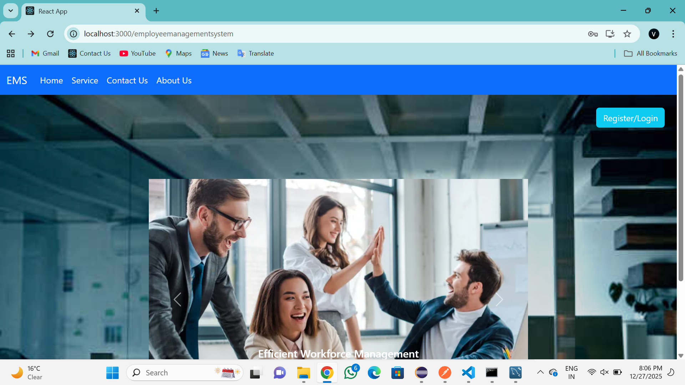

### 🔐 Login
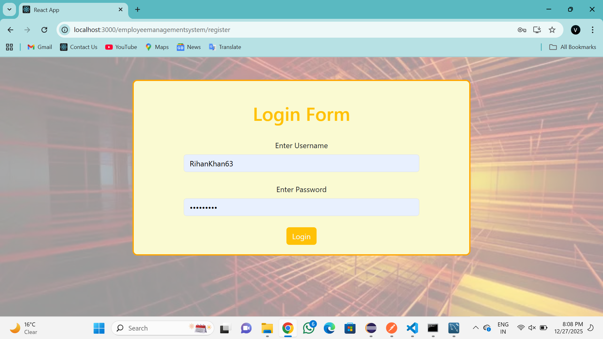

### 📝 Register
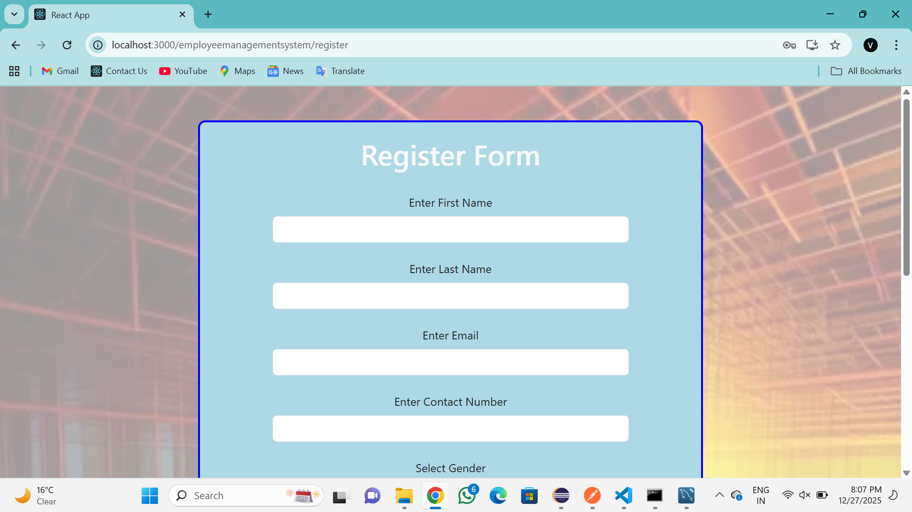
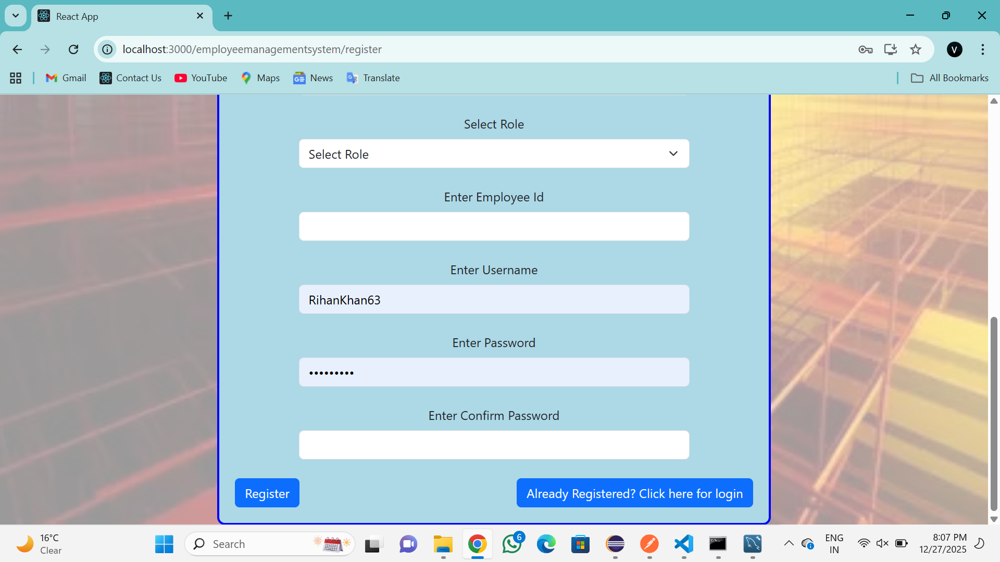

### 👨‍💼 Admin Dashboard
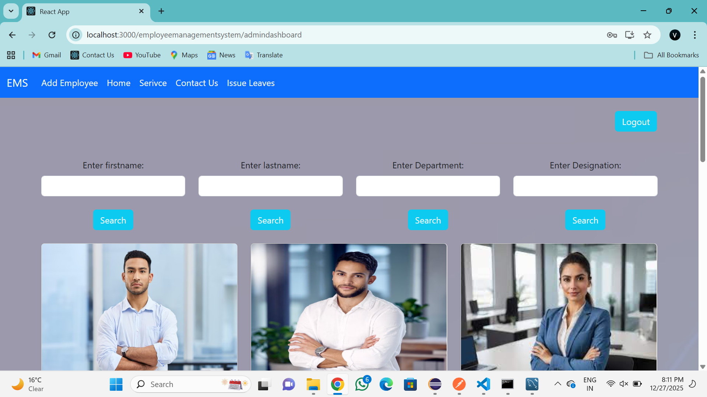

### 📊 Admin Cards
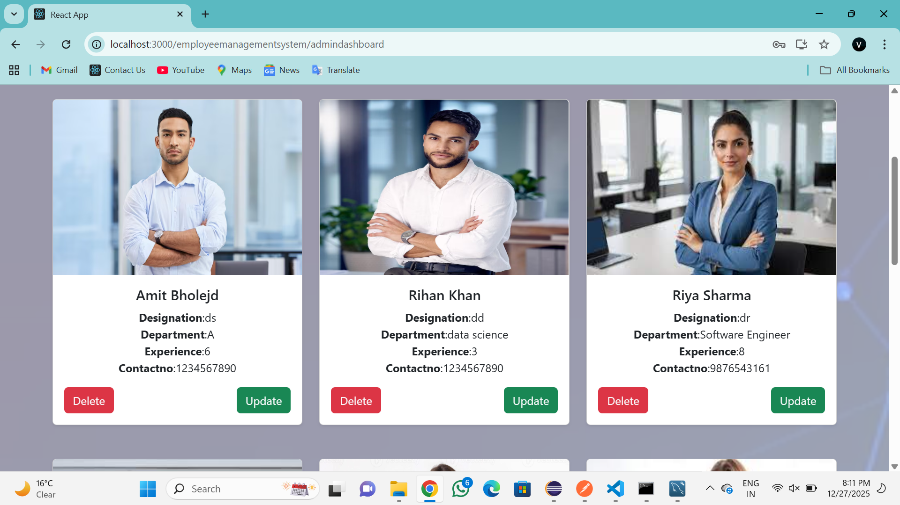

### ➕ Add Employee
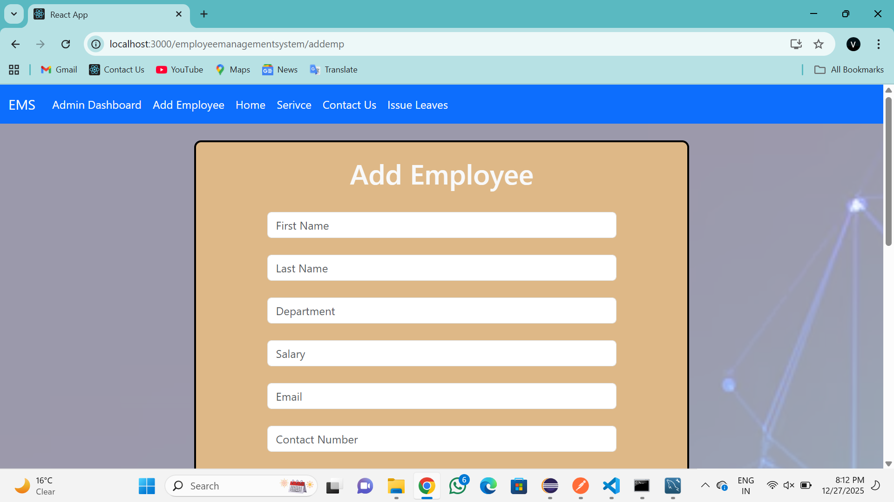

### 📄 Search by Department
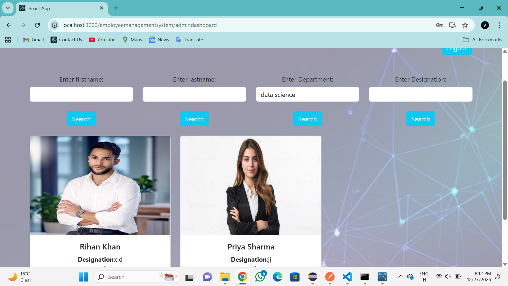

### 🧾 Issue Leave
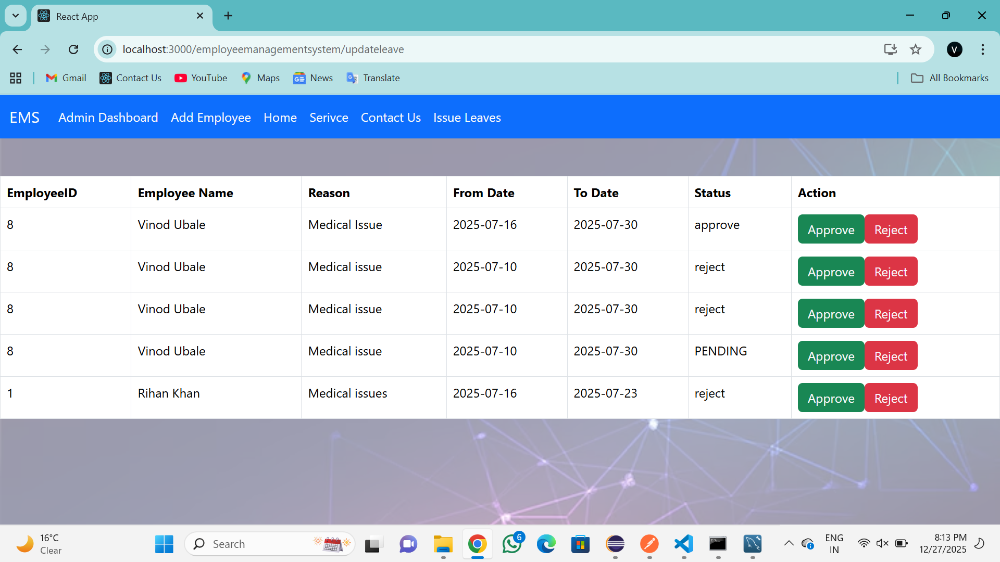

### 📝 Apply for Leave
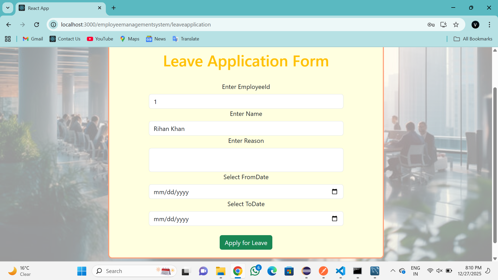

### 📊 Leave Status
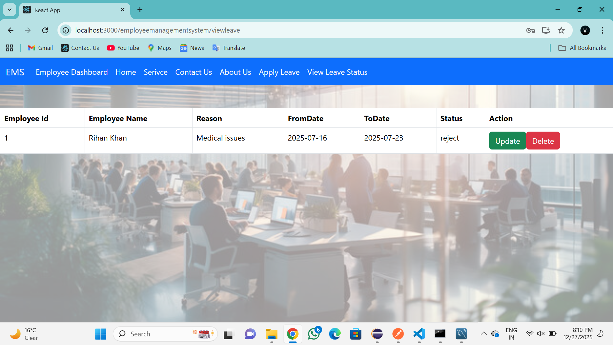

### 👩‍💻 User Dashboard
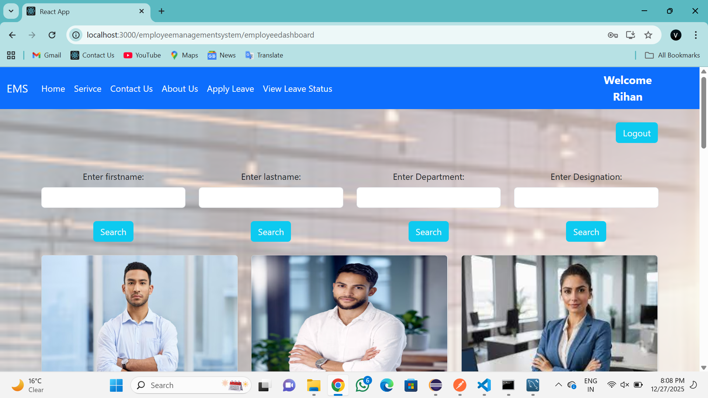

### 🧩 User Cards
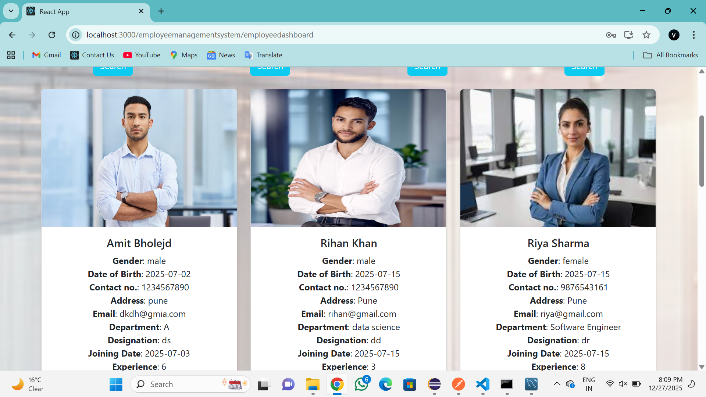

### ℹ️ About Us
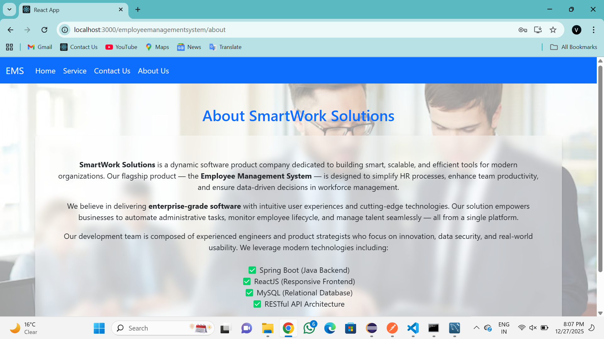

### 📞 Contact Us
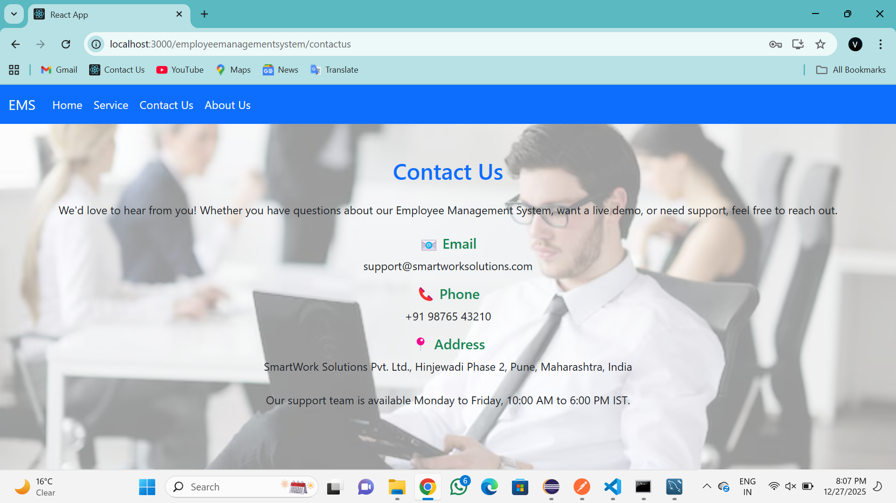

### 🛠️ Service Page


📌 About the Project

This Employee Management System helps organizations efficiently manage employees, leave workflows, and communication.
Admins can control employee data, while employees can easily manage their profiles and leave requests.

👨‍💻 Author

Vinod Ubale
GitHub: https://github.com/Ubalevinod
